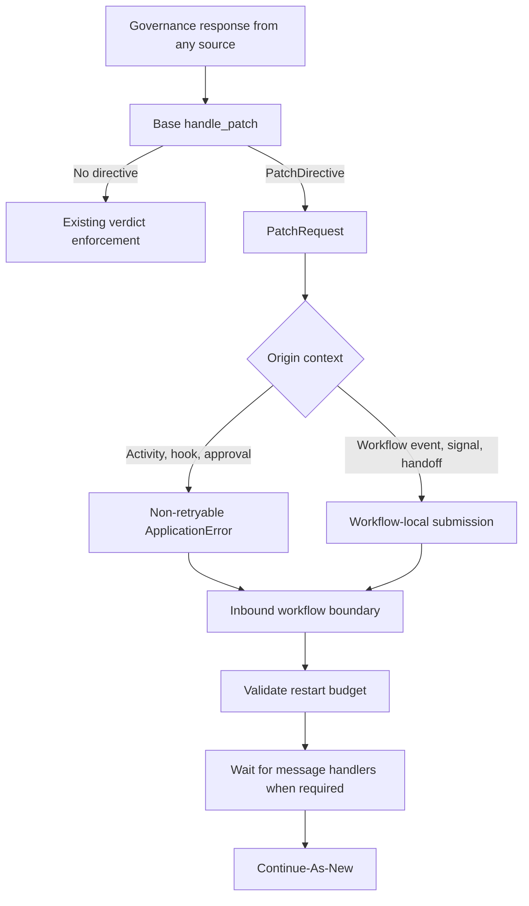

# Proposal: BLOCK-with-Patch Workflow Restart

**Status:** Proposed

**Date:** 2026-07-20

**Target:** `openbox-temporal-sdk-python`

**Dependency:** `openbox-sdk-python` BLOCK-with-patch contract, currently on
`feat/retryable-block-directive` at `0d27340`

---

## 1. Summary

Add first-class handling for an OpenBox governance response shaped as:

```json
{
  "verdict": "block",
  "patch": {
    "new_input": {"example": "replacement workflow input"}
  }
}
```

When any governance evaluation returns `BLOCK` with a valid `patch`, the
Temporal SDK will:

1. stop the current execution path with a non-retryable Temporal
   `ApplicationError` carrying a versioned restart request;
2. prevent Temporal from retrying the blocked activity with the same input;
3. catch the restart request at the workflow interceptor boundary; and
4. Continue-As-New using `patch.new_input`.

This rule is event-agnostic. All accepted governance `event_type` values use the
same normalization and restart logic:

- `WorkflowStarted`
- `WorkflowCompleted`
- `WorkflowFailed`
- `SignalReceived`
- `ActivityStarted`
- `ActivityCompleted`
- `Handoff`

Hook evaluations also use this logic. Hooks are represented on the wire as
`ActivityStarted` with `hook_trigger=true`, regardless of whether the hook stage
is `started` or `completed`. Approval poll responses use the same patch
inspector as evaluation responses.

There will be no event allowlist and no pre-execution/post-execution eligibility
gate. `event_type`, `hook_trigger`, and hook stage are origin metadata, not
authorization conditions. The presence of a valid patch on an exact
`BLOCK` verdict is the authorization to restart.

---

## 2. Motivation

A normal Temporal activity retry is not suitable for input remediation. It
re-executes the same scheduled activity with the same arguments. A governance
`patch`, by contrast, supplies replacement input for the whole workflow.

A Temporal Workflow Retry Policy is also the wrong mechanism: it normally
repeats the workflow with the original input, cannot directly consume the
governance response, and can repeat the same deterministic failure.

Continue-As-New matches the required semantics:

- the Workflow ID remains unchanged;
- the replacement execution receives a new Run ID and fresh Event History;
- the next run receives the corrected input; and
- the previous run closes as `ContinuedAsNew`, preserving one workflow chain.

The non-retryable `ApplicationError` is therefore a transport signal across the
activity/workflow boundary. It prevents an automatic activity retry; it is not
the terminal status of a successfully honored restart request.

---

## 3. Required Invariants

### 3.1 Verdict matrix

| Governance result | Required behavior |
|---|---|
| `ALLOW` / `CONSTRAIN` | Existing behavior |
| `REQUIRE_APPROVAL` | Existing HITL behavior |
| `BLOCK` without a valid patch | Existing terminal BLOCK behavior |
| `BLOCK` with malformed `patch` | Treat as plain BLOCK |
| `BLOCK` with valid `patch` | Request Continue-As-New |
| `HALT`, with or without a patch | Existing HALT behavior; never restart |
| Expired approval result | Existing expiry behavior; never restart |
| Pending approval result | Continue polling; never restart |

The SDK must call the base SDK's `handle_patch()` rather than
reimplementing this matrix.

### 3.2 Event matrix

| Origin | Current transport | Target handling |
|---|---|---|
| `WorkflowStarted` | Governance activity | Normalize request and Continue-As-New before user workflow code |
| `WorkflowCompleted` | Governance activity | Normalize request and Continue-As-New instead of returning the result |
| `WorkflowFailed` | Governance activity | Normalize request and Continue-As-New instead of rethrowing the original failure |
| `SignalReceived` | Governance activity | Store a workflow-local request; the main execution path performs Continue-As-New |
| `ActivityStarted` | Direct HTTP in activity | Raise non-retryable restart `ApplicationError`; workflow boundary catches it |
| `ActivityCompleted` | Direct HTTP in activity | Raise non-retryable restart `ApplicationError`; workflow boundary catches it |
| `Handoff` | Governance activity from workflow code | Propagate the normalized request to the workflow boundary |
| Started hook | Base runtime and Temporal adapter | Raise the same non-retryable restart `ApplicationError` immediately |
| Completed hook | Base runtime and state bridge | Record the full request and raise it after user operation returns |
| Approval poll | Direct HTTP in activity | Inspect `ApprovalResult`; raise the same restart error for non-expired `BLOCK` plus patch |

### 3.3 Priority

Priority remains:

```text
HALT > BLOCK with patch > plain BLOCK > guardrails failure
     > REQUIRE_APPROVAL > CONSTRAIN > ALLOW
```

Within a run, the first valid patch request wins. A HALT observed before the
Continue-As-New command is emitted still takes precedence. This keeps concurrent
signal/activity behavior deterministic and prevents competing inputs from
silently overwriting each other.

### 3.4 Input mapping

The `patch.new_input` wire contract describes one workflow input value.
The Temporal mapping will be:

```python
if directive.new_input is None:
    workflow.continue_as_new(args=current_workflow_args)
else:
    workflow.continue_as_new(directive.new_input)
```

Consequences:

- `None` means reuse all arguments of the current run exactly.
- A non-null string, number, list, or object is passed as one workflow argument.
- A JSON list is a single list-valued argument, not an implicit positional-args
  list.
- Workflows accepting replacement input should follow Temporal's recommended
  single input-object pattern and keep the replacement type compatible.

---

## 4. Base SDK Contract

The Temporal SDK will consume these symbols from `openbox_core.contracts`:

```python
Patch
PatchDirective
handle_patch
```

The base helper returns a directive only when all of the following are true:

- the parsed verdict is exactly `Verdict.BLOCK`;
- `patch` is a valid object containing exactly `new_input`;
- `new_input` satisfies the base SDK JSON/safe-number rules; and
- an `ApprovalResult` is not expired.

`new_input=None` is a valid directive and is distinct from an absent or invalid
patch. `HALT` never produces a directive.

This package must raise its declared minimum `openbox-sdk-python` version to the
first published release containing commit `0d27340`. The branch or commit must
not be used as a production package dependency.

---

## 5. Proposed Design

### 5.1 One semantic normalizer

Add a small, pure, sandbox-safe module, for example
`openbox/patch.py`, containing the Temporal-owned request envelope and
normalization helper:

```python
@dataclass(frozen=True)
class PatchRequest:
    schema_version: int
    new_input: Any
    governance_event_id: str | None
    reason: str | None
    event_type: str
    hook_trigger: bool
    hook_stage: str | None


def patch_request(
    result: EvaluationResult | ApprovalResult,
    *,
    event_type: str,
    hook_trigger: bool = False,
    hook_stage: str | None = None,
) -> PatchRequest | None:
    directive = handle_patch(result)
    if directive is None:
        return None
    return PatchRequest(
        schema_version=1,
        new_input=directive.new_input,
        governance_event_id=directive.governance_event_id,
        reason=directive.reason,
        event_type=event_type,
        hook_trigger=hook_trigger,
        hook_stage=hook_stage,
    )
```

Every governance response must pass through this helper before existing BLOCK,
HALT, guardrail, or HITL enforcement. No caller may inspect raw `patch`
itself.

### 5.2 Versioned Temporal error transport

Add a stable error type constant:

```python
GOVERNANCE_PATCH_ERROR_TYPE = "GovernancePatch"
```

Activity-side code raises:

```python
raise ApplicationError(
    "Governance requested workflow restart",
    request.to_dict(),
    type=GOVERNANCE_PATCH_ERROR_TYPE,
    non_retryable=True,
)
```

Example detail payload:

```json
{
  "schema_version": 1,
  "new_input": {"query": "corrected value"},
  "governance_event_id": "evt_123",
  "reason": "Patch with corrected input",
  "event_type": "ActivityCompleted",
  "hook_trigger": false,
  "hook_stage": null
}
```

The workflow-side extractor must walk `ActivityError.cause` and nested exception
chains, match only the stable `ApplicationError.type`, validate
`schema_version`, and reconstruct `PatchRequest`. It must never parse
the human-readable message.

Malformed or unknown-version details fail safely as an ordinary non-retryable
governance BLOCK; they must not become a Workflow Task retry loop.

### 5.3 Workflow restart coordinator

The inbound workflow interceptor owns one run-local coordinator. It is the only
component allowed to call `workflow.continue_as_new()`.



The coordinator stores only the first request and wakes the main
`execute_workflow()` path. It must not depend on `TemporalGovernanceState`,
because that object is process-local, shared with activity threads, and not a
durable workflow-history primitive.

For ordinary activity failures, the outer interceptor extracts the request from
the `ActivityError` chain before reporting `WorkflowFailed`. A patch request is
not itself reported as `WorkflowFailed`, because the run will close as
Continued-As-New.

Application code must not catch and suppress `GovernancePatch` control
failures. As with cancellation and Continue-As-New control flow, swallowing the
SDK's control failure makes the application responsible for the resulting
behavior.

### 5.4 Signal handling

Temporal recommends that Continue-As-New not be called from a Signal or Update
handler. Therefore, `SignalReceived` uses the same request type but a coordinated
execution path:

1. evaluate `SignalReceived` through the governance activity;
2. if it returns a BLOCK with patch, do not invoke the user signal handler;
3. submit the request to the run-local coordinator;
4. return from the interceptor's signal handler; and
5. let the main `execute_workflow()` path wait until message handlers finish and
   then call Continue-As-New.

The main path must be able to wake even when the user workflow is long-running;
it should deterministically wait on the user workflow task and the coordinator
condition rather than waiting for user code to return naturally.

### 5.5 Workflow lifecycle events

`WorkflowStarted` and `WorkflowCompleted` should route their governance outcomes
through the coordinator before entering or returning from user code.

`WorkflowFailed` requires special treatment. The current code intentionally
swallows failures from the failure-reporting activity so reporting problems do
not shadow the original workflow exception. The revised rule is:

- continue swallowing governance API/reporting failures according to existing
  behavior;
- do not swallow a valid `GovernancePatch` request;
- if `WorkflowFailed` itself returns a valid patch, Continue-As-New and do
  not rethrow the original workflow exception; and
- if it returns no patch, rethrow the original exception unchanged.

### 5.6 Handoff

`emit_handoff()` already routes through the workflow-safe governance activity.
It must propagate a patch request to the same inbound workflow coordinator
instead of converting the activity's `GovernanceBlock` to `None`.

The public return behavior for ALLOW and fail-open API errors remains unchanged.

### 5.7 Activity lifecycle events

`ActivityStarted` and `ActivityCompleted` responses are already parsed as
`GovernanceVerdictResponse`. `_enforce_verdict()` must inspect the patch
before calling the existing generic `enforce_verdict()` function.

This preserves guardrails and HITL ordering while ensuring a BLOCK with patch is
not prematurely converted into `GovernanceBlockedError` and then
`GovernanceBlock`.

### 5.8 Hooks and completed-hook bridge

`TemporalFrameworkAdapter.raise_lifecycle_blocked()` and
`raise_hook_blocked()` must inspect the directive before their existing BLOCK
mapping.

For a completed hook, the underlying operation has already occurred. This does
not change eligibility. `TemporalGovernanceState` must record the complete
`PatchRequest`, not just `(verdict, reason)`. The activity interceptor
then consumes it and raises `GovernancePatch` after user code returns.

On an exception path, completed-hook priority is:

```text
HALT > BLOCK with patch > original activity exception > plain completed BLOCK
```

This ensures a valid completed-hook patch is not discarded merely because
user code also raised.

### 5.9 HITL approval polling

`handle_approval_response()` must parse `ApprovalResult` first and call the same
normalizer before its existing expired/allow/block/pending branches.

The base helper already refuses expired approvals, so the resulting order is:

1. non-expired exact BLOCK plus valid patch -> restart request;
2. expired -> `ApprovalExpired`;
3. ALLOW -> proceed;
4. plain BLOCK/HALT -> `ApprovalRejected`;
5. pending -> `ApprovalPending`.

---

## 6. Workflow Restart Budget

An input-remediation policy can repeatedly produce another BLOCK with patch.
The SDK must prevent an unbounded Continue-As-New chain.

Add one global configuration value:

```python
max_patch_restarts: int = 3
```

It applies uniformly to every event type; it is not an event eligibility flag.
The value must be at least `1`.

Store the counter in workflow memo under a namespaced key, for example:

```text
openbox_retryable_block_restart_count
```

Before Continue-As-New:

1. read the current count, defaulting to zero;
2. fail safely if the memo value is not a non-negative integer;
3. increment it;
4. if the configured maximum would be exceeded, fail the workflow with a
   non-retryable `ApplicationError(type="GovernancePatchLimitExceeded")`; and
5. otherwise copy the current memo, update the count, and pass the complete memo
   to Continue-As-New.

Copying the full memo preserves existing application metadata and the OpenBox
multi-agent session ID. Task queue, workflow type, run timeout, search
attributes, and other Continue-As-New options should use Temporal's current-run
defaults.

The counter is across the workflow chain, regardless of which event type caused
each restart.

---

## 7. Current Gaps and Change Surface

### `openbox/activities.py`

- `_build_verdict_result()` drops `patch`.
- `send_governance_event()` manually parses a subset of response fields.
- `_handle_stop_verdict()` special-cases `SignalReceived` and raises plain
  `GovernanceBlock` for other BLOCK results.

Use `GovernanceVerdictResponse.from_dict()` and inspect the shared patch helper
before existing stop handling.

### `openbox/workflow_interceptor.py`

- `_send_governance_event()` currently converts `GovernanceBlock` to `None`.
- `WorkflowStarted` is outside the main lifecycle try/catch.
- `WorkflowFailed` reporting swallows every exception.
- signals store only `(verdict, reason)` for the next activity.

Add error-detail extraction, the coordinator, signal submission, and explicit
`WorkflowFailed` patch propagation.

### `openbox/activity_interceptor.py`

- Activity lifecycle enforcement converts every BLOCK to plain
  `GovernanceBlock`.
- completed-hook state carries too little information.
- approval rejections do not inspect a patch.

Add patch inspection before existing verdict branches and consume full completed
requests.

### `openbox/core_adapter.py`

- started/lifecycle hook BLOCK always maps to plain `GovernanceBlock`.
- completed-hook state records only verdict and reason.

Normalize first, then select the patch or existing enforcement path.

### `openbox/governance_state.py`

Extend the completed-hook entry to carry the typed request. Do not use this
process-local object as the workflow coordinator or restart counter.

### `openbox/hitl.py`

Inspect `ApprovalResult` with `handle_patch()` before mapping plain
BLOCK/HALT to `ApprovalRejected`.

### `openbox/multi_agent.py`

Allow a Handoff patch request to reach the coordinator. Keep existing ALLOW and
fail-open results compatible.

### `openbox/errors.py`

Add constants for:

- `GovernancePatch`
- `GovernancePatchLimitExceeded`
- optionally `GovernancePatchInputInvalid` if input conversion has a distinct
  failure path

### `openbox/config.py`, `openbox/worker.py`, and `openbox/plugin.py`

Expose and validate `max_patch_restarts`, with the same value passed to
the workflow interceptor in both factory and plugin construction paths.

### `pyproject.toml`

Raise the base SDK dependency floor to the published version containing the
patch contract.

---

## 8. Replay and Determinism

The workflow-side behavior change must be protected with a Temporal patch marker,
for example:

```python
workflow.patched("openbox-retryable-block-v1")
```

Reasons:

- introducing a Continue-As-New command changes workflow history;
- older open histories may contain governance activity results/failures produced
  before the new transport existed; and
- deployments must be able to replay old histories without taking a new branch.

The coordinator may use only workflow-safe deterministic primitives. It must not
read wall-clock time, process-global mutable state, or activity-thread state.
Governance HTTP remains inside activities, so its recorded result/failure is
replayable.

The workflow memo counter is durable because it becomes input metadata for the
next run. The error detail payload and `new_input` are recorded in Temporal
history by the normal activity failure/Continue-As-New commands.

---

## 9. Failure Semantics

| Condition | Temporal result |
|---|---|
| Valid request below restart limit | Current run `ContinuedAsNew`; new run starts |
| Plain BLOCK | Existing non-retryable activity/workflow failure behavior |
| HALT | Existing workflow termination behavior |
| Invalid/unknown restart error details | Fail safely as plain governance BLOCK |
| Restart limit exceeded | Workflow `Failed` with non-retryable `GovernancePatchLimitExceeded` |
| Replacement input serialization failure | Workflow `Failed` with non-retryable input error |
| Governance API unavailable with `fail_open` | Existing fail-open behavior |
| Governance API unavailable with `fail_closed` | Existing fail-closed behavior |

Continue-As-New is intentionally not represented as a failed run. Consumers that
need to audit remediation should use the governance event ID, Temporal run chain,
and SDK restart-count metadata.

---

## 10. Side Effects and Idempotency

A patch may be produced by `ActivityCompleted`, a completed hook,
`WorkflowCompleted`, or `WorkflowFailed`, after application side effects have
already occurred. Those sources remain eligible by product requirement.

Therefore:

- activities must remain idempotent;
- external writes should use stable business idempotency keys rather than a Run
  ID that changes across Continue-As-New;
- policy/admin authors are responsible for emitting replacement input that does
  not repeat unsafe work; and
- the SDK must not silently add source-specific restrictions to compensate for
  non-idempotent application design.

This risk should be documented prominently in the user-facing configuration or
integration guide.

---

## 11. Observability and Security

Emit structured logs/telemetry for:

- restart requested;
- origin `event_type`, hook flag/stage, and governance event ID;
- current and next restart count;
- Continue-As-New scheduled; and
- restart rejected because the budget or detail schema is invalid.

Do not log `new_input`; it may contain credentials, personal data, or proprietary
workflow content. Temporal will already persist workflow input according to the
application's configured data converter and codec.

Do not put OpenBox credentials into the request envelope, workflow input, memo,
or error details.

---

## 12. Compatibility

- Responses without `patch` behave exactly as today.
- Malformed patches degrade to the existing plain BLOCK behavior.
- Existing error types `GovernanceBlock`, `GovernanceHalt`, `ApprovalPending`,
  `ApprovalRejected`, and `ApprovalExpired` keep their current meanings.
- Existing Handoff ALLOW/fail-open return values remain compatible.
- Public workflow signatures do not change.
- Existing Core payloads do not change; this is response handling only.
- The feature is uniform when present; there are no event-specific enable flags.

---

## 13. Verification Plan

### 13.1 Base-contract tests

Confirm against the released base SDK:

- exact BLOCK plus valid patch returns `PatchDirective`;
- `new_input=None` remains distinguishable from no patch;
- malformed objects, booleans, unsafe numbers, and non-BLOCK verdicts return no
  directive;
- HALT never returns a directive; and
- expired/pending approvals never return a directive.

### 13.2 Temporal error transport tests

- `GovernancePatch` is always `non_retryable=True`.
- Detail schema round-trips through `ActivityError -> ApplicationError`.
- Nested exception extraction uses `ApplicationError.type`, not messages.
- Unknown schema versions fail as plain BLOCK.

### 13.3 Parameterized event coverage

For every event type in the event matrix, verify:

- a valid BLOCK with patch reaches the coordinator;
- plain BLOCK preserves existing behavior;
- HALT preserves existing behavior; and
- ALLOW preserves existing behavior.

Include separate cases for started and completed hooks and for HITL polling.

### 13.4 Workflow coordinator tests

- non-null replacement is passed as one workflow argument;
- null replacement reuses all current arguments;
- first request wins;
- signal-originated requests are executed from the main workflow path;
- user signal handler is not invoked after a BLOCK with patch;
- handlers finish before Continue-As-New;
- `WorkflowFailed` patch overrides the original failure;
- ordinary failure-reporting errors do not shadow the original failure;
- Handoff request propagates; and
- restart count is copied and enforced across runs.

### 13.5 Replay tests

- replay a pre-feature history with the new worker;
- replay a history containing the patch marker;
- replay an activity failure carrying the versioned detail payload; and
- verify no process-local state is required to reproduce the command sequence.

### 13.6 End-to-end Temporal tests

Using Temporal's ephemeral test server, assert:

- same Workflow ID before and after restart;
- different Run IDs;
- old run status is `ContinuedAsNew`;
- new run receives the expected `new_input`;
- the governance activity is not automatically retried;
- signal, activity, `WorkflowFailed`, and Handoff origins all restart; and
- the global restart limit terminates the chain predictably.

Run the existing full test suite afterward to protect BLOCK, HALT, guardrails,
HITL, multi-agent, signing, sandbox, and plugin behavior.

---

## 14. Acceptance Criteria

The proposal is complete when:

1. Every accepted `event_type`, both hook stages, and approval polling route a
   valid BLOCK with patch through one semantic normalizer.
2. Activity-side patch requests use a stable, versioned, non-retryable
   `ApplicationError`.
3. Only the inbound workflow execution path calls Continue-As-New.
4. `SignalReceived` does not call Continue-As-New inside its handler.
5. `WorkflowFailed` can replace an original failure with a valid patch.
6. `new_input=None` reuses current input; every other supported value is one
   replacement workflow argument.
7. No event allowlist or hook-stage restriction exists.
8. HALT, expired approvals, malformed patches, and plain BLOCK never restart.
9. Restart loops are bounded across the whole workflow chain.
10. Existing histories replay and existing non-patch behavior remains
    compatible.

---

## 15. Implementation Sequence

1. Publish and consume the base SDK version containing the patch contract.
2. Add the pure request envelope, error constants, serializers, and extractors.
3. Preserve and inspect patches in the workflow governance activity.
4. Add patch handling to activity lifecycle enforcement, the Temporal base
   adapter, completed-hook state, and HITL polling.
5. Add the workflow restart coordinator and patch marker.
6. Integrate signals, lifecycle failure reporting, and Handoff.
7. Add unit, replay, and end-to-end tests.
8. Update architecture, configuration, and changelog documentation.

---

## 16. Alternatives Considered

### Temporal activity retry

Rejected because it retries the same activity with the same arguments and does
not restart the workflow with replacement input.

### Workflow Retry Policy

Rejected because it repeats the workflow failure path, normally with unchanged
input, and is not driven by the governance directive.

### Fail the workflow and start a separate workflow through the client

Rejected as the default because it requires out-of-band orchestration, creates a
separate workflow chain, complicates Workflow ID reuse, and introduces a gap
between failure and replacement creation.

### Call Continue-As-New from each event handler

Rejected because signal/update handlers should not perform Continue-As-New, and
distributed callers would duplicate budget, input, versioning, and error logic.

### Enable only pre-execution event types

Rejected because every governance event type may legitimately return a patch.
Event origin is metadata, not eligibility.

---

## 17. Research Basis

- [Temporal Python Continue-As-New documentation](https://docs.temporal.io/develop/python/workflows/continue-as-new): same Workflow ID, new Run ID, fresh history, input passed to the next run, and message-handler guidance.
- [Temporal Python error-handling documentation](https://docs.temporal.io/develop/python/best-practices/error-handling): activity `ApplicationError`, `ActivityError` wrapping, non-retryable failures, idempotency, and Workflow Retry Policy guidance.
- [Temporal Python API reference for `workflow.continue_as_new`](https://python.temporal.io/temporalio.workflow.html#continue_as_new): single/multiple argument mapping, memo/default behavior, and `ContinueAsNewError` control flow.
- `openbox-sdk-python/openbox_core/contracts/results.py` on
  `feat/retryable-block-directive` at `0d27340`: strict patch parsing and
  `handle_patch()` semantics.
